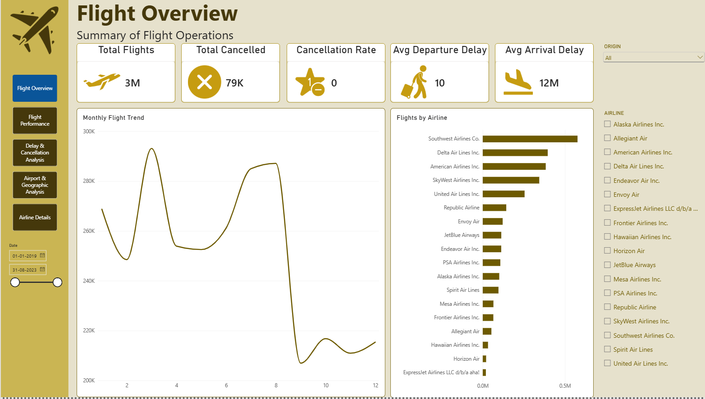
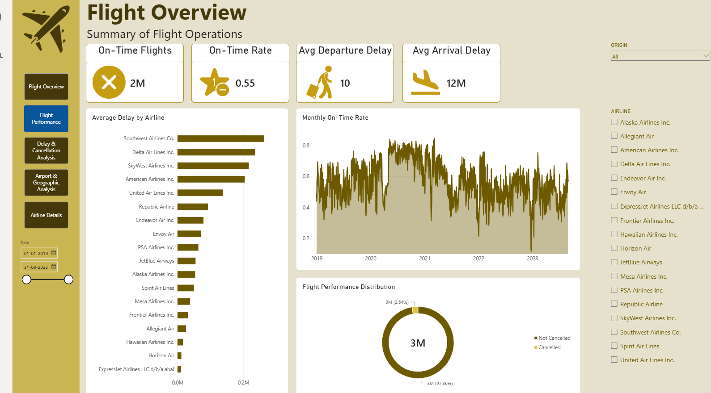
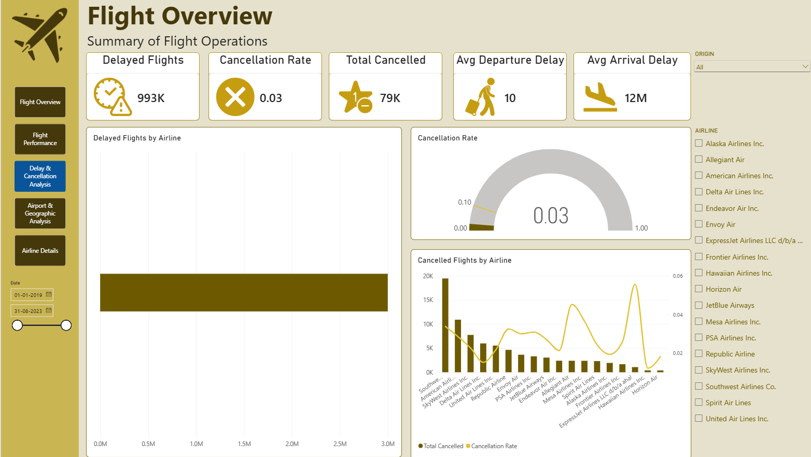
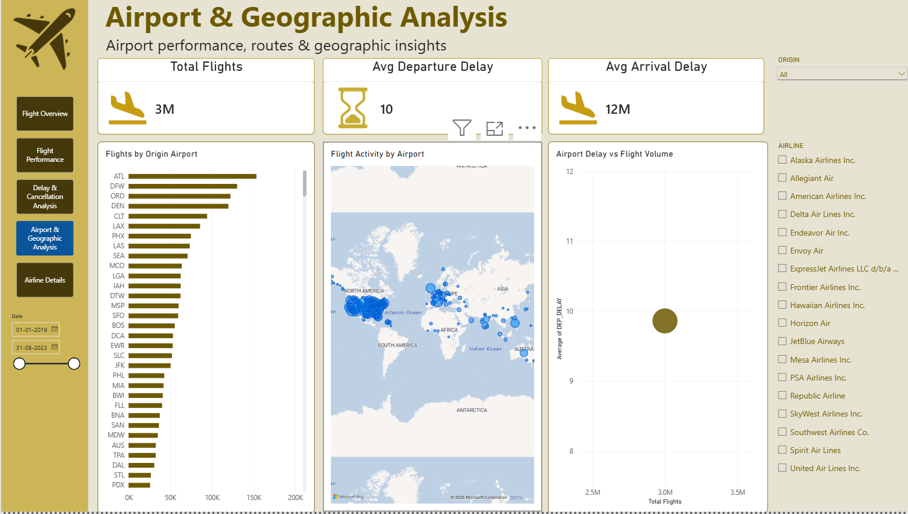
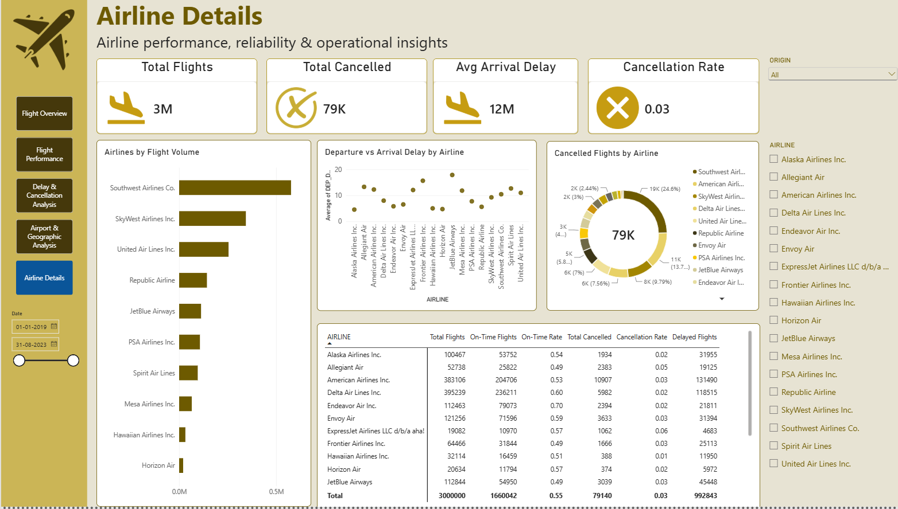
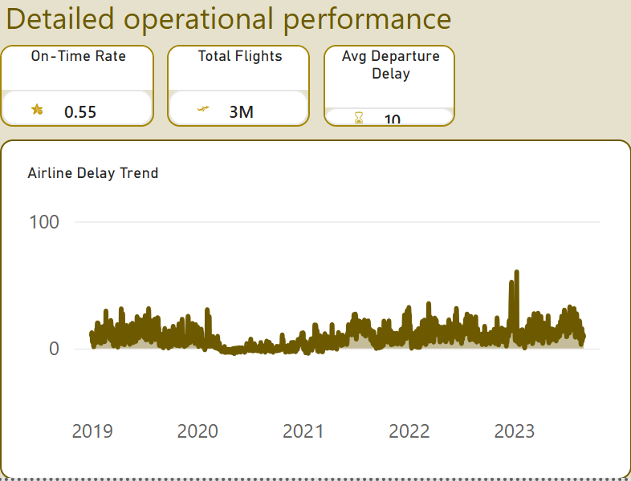

# ✈️ Flight Analytics Dashboard

## 📊 Project Overview

This Power BI project is an interactive **Flight Analytics Dashboard**
designed to analyze flight operations, airline performance, delays,
cancellations, airport activity, and airline-level details.

The report uses a professional **gold, dark-brown, and cream** theme
with KPI cards, charts, slicers, maps, tables, navigation buttons, and
report-page tooltips.

## 🎯 Project Objectives

- Monitor overall flight activity and operational performance.
- Analyze on-time flights and on-time rate.
- Understand delays and cancellations.
- Compare airline performance.
- Analyze airport activity and geographic distribution.
- Provide detailed airline-level operational information.
- Present insights clearly for a client, interviewer, or project
  reviewer.

## 📑 Dashboard Pages

### 1. Flight Overview

**KPIs:** Total Flights, Total Cancelled, Cancellation Rate, Average
Departure Delay, Average Arrival Delay.

**Visuals:** Monthly Flight Trend, Flights by Airline, Origin filter,
Airline filter.

<figure>

<figcaption aria-hidden="true">Flight Overview</figcaption>
</figure>

### 2. Flight Performance

**KPIs:** On-Time Flights, On-Time Rate, Average Departure Delay,
Average Arrival Delay.

**Visuals:** Average Delay by Airline, Monthly On-Time Rate, Flight
Performance Distribution.

<figure>

<figcaption aria-hidden="true">Flight Performance</figcaption>
</figure>

### 3. Delay & Cancellation Analysis

**KPIs:** Delayed Flights, Cancellation Rate, Total Cancelled, Average
Departure Delay, Average Arrival Delay.

**Visuals:** Delayed Flights by Airline, Cancellation Rate Gauge,
Cancelled Flights by Airline, cancellation-rate comparison.

<figure>

<figcaption aria-hidden="true">Delay &amp; Cancellation
Analysis</figcaption>
</figure>

### 4. Airport & Geographic Analysis

**KPIs:** Total Flights, Average Departure Delay, Average Arrival Delay.

**Visuals:** Flights by Origin Airport, Flight Activity by Airport,
Airport Delay vs Flight Volume.

**Filters:** Origin, Airline, Date.

<figure>

<figcaption aria-hidden="true">Airport &amp; Geographic
Analysis</figcaption>
</figure>

### 5. Airline Details

**KPIs:** Total Flights, Total Cancelled, Average Arrival Delay,
Cancellation Rate.

**Visuals:** Airlines by Flight Volume, Departure vs Arrival Delay by
Airline, Cancelled Flights by Airline, detailed airline table.

**Table fields:** Airline, Total Flights, On-Time Flights, On-Time Rate,
Total Cancelled, Cancellation Rate, Delayed Flights.

<figure>

<figcaption aria-hidden="true">Airline Details</figcaption>
</figure>

## 🧩 Report Page Tooltip

A dedicated tooltip page provides detailed operational information when
users hover over relevant visuals.

**Tooltip KPIs:** On-Time Rate, Total Flights, Average Departure Delay.

**Tooltip visual:** Airline Delay Trend.

<figure>

<figcaption aria-hidden="true">Airline Tooltip</figcaption>
</figure>

## 🔍 Interactivity

- Airline slicer
- Origin slicer
- Date range slicer
- Cross-filtering
- Page navigation buttons
- Report-page tooltip
- Interactive charts and tables

## 🛠️ Tools & Technologies

- **Microsoft Power BI**
- **Power Query** for data transformation
- **DAX** for measures and calculations
- Interactive charts and KPI cards
- Geographic/map visualization
- Slicers and report-page tooltips

## 📐 Important Measures

The report includes measures for:

- Total Flights
- On-Time Flights
- On-Time Rate
- Total Cancelled
- Cancellation Rate
- Delayed Flights
- Average Departure Delay
- Average Arrival Delay

Example:

``` dax
On-Time Flights =
CALCULATE(
    COUNTROWS('Flights'),
    'Flights'[DEP_DELAY] <= 0,
    'Flights'[ARR_DELAY] <= 0,
    'Flights'[CANCELLED] = 0
)
```

> Use the exact column names from your Power BI model.

## 🎨 Design Theme

- **Primary:** Gold
- **Background:** Cream / light beige
- **Text:** Dark brown
- **Navigation:** Dark brown
- **Selected page:** Blue highlight
- **Cards:** White with gold borders

## 📌 Project Flow

**Flight Overview → Flight Performance → Delay & Cancellation Analysis →
Airport & Geographic Analysis → Airline Details → Airline Tooltip**

## 📈 Key Insights

The dashboard enables users to identify:

- Overall flight volume
- Airline flight-volume differences
- On-time performance trends
- Average departure and arrival delays
- Cancellation levels and rates
- Airport flight activity
- Relationship between flight volume and delay
- Airline-level operational performance

## 👤 Intended Audience

- Data analyst portfolio
- Data analytics interview
- Academic project
- Client presentation
- Business reporting
- Flight and airline operational analysis

## 📂 Repository Structure

``` text
Flight-Analytics-Dashboard/
├── README.md
├── images/
│   ├── flight-overview.png
│   ├── flight-performance.png
│   ├── delay-cancellation-analysis.png
│   ├── airport-geographic-analysis.png
│   ├── airline-details.png
│   └── airline-tooltip.png
└── Flight_Analytics_Dashboard.pbix
```

## ⭐ Conclusion

This project combines flight operations data into a single interactive
Power BI solution covering **overview, performance, delays,
cancellations, geographic analysis, and airline details**. The dashboard
is designed to make operational insights easy to explore and present.
